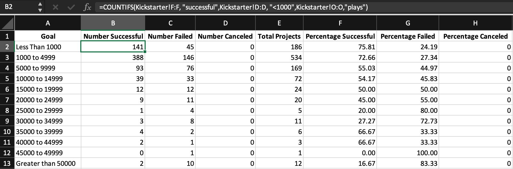

# An analysis of Kickstarter Campaigns

   #### This analysis contains the following:
   ##### - Contents
   ##### - Overview
   ##### - Analysis and Chanllenges
   ##### - Results
   ##### - tables, charts, plots, images, descriptive statistics
   ##### - comparative analysis

### Overview of Project
This project analyzes data from Kickstarter Campaigns to help identify trends that lead to the success or failures of campaigns. The analysis was done to help an artist (client) gauge the potential success of her kickstarter campaign. Subcategories, color-coding, pictures, and other items were used to help easily identify trends in this data.

An overview of this data is displayed below:
    
 
### Analysis and Challenges
#### Pre-Analysis
I started with downloading the raw data, which included information from 4,113 Kickstarter campaigns. I then assessed the data from a categorical perspective -- isolating just the "theatre" catagory's outcomes (parent category), as shown below: 
    
Looking at this chart, we can see that the majority of theatre campaigns were successful, while the number of failed theatre campaigns followed closely after. There were few canceled and fewer live.

#### Analysis
My client requested a chart on outcomes based on launch date for the theatre category. To fulfill this request, I created another sheet in the workbook titled "Theatre Outcomes by Launch Date" and applied the following conditions (see image below) to compare the successful, failed, and canceled outcomes:
    
    I then plotted these results:
    
    As we can see, the most successful theatre campaigns were launched between April and May. We take special note that the theatre campaigns launched in Decemeber appear to have tied for the outcomes of success or failure.
    
Taking this analysis even further, I created another sheet in the workbook titled "Outcomes Based on Goals" and used the COUNTIFS function to visualize these same 3 outcomes, filtering for just the "plays" subcategory, as displayed in the image below:
    
    Looking at the 3 outcomes percentages, I created the following chart:
    
    Here we see that the most successful "plays" campaigns, by percentage of goal, set a goal between _ and the most failed "plays" campaigns set a goal between $45,000-50,000.
    
#### Challenges
It was a bit challenging to figure out how to correctly apply the COUNTIFS function with the correct conditionals or criteria and range. I ran into some syntax erros here that I had to fix. I found it helpful to view one cell at a time and move over one column in that row, to the right, changing just one condition, rather than double clicking to drop a formula down. Working vertically, rather than horizontally as descived, is where I started getting syntax errors.
    
### Results
#### Questions: 
* What are two conclusions you can draw about the Theater Outcomes by Launch Date?
* What can you conclude about the Outcomes based on Goals?
* What are some limitations of this dataset?
* What are some other possible tables and/or graphs that we could create?

#### Answers:
* Based on the line chart displayed above (titled Theatre Outcomes Based on Launch Date), we can see that 1) The highest number of successful theatre campaigns were launched in between April and May, peaking in May and rapidly declining to follow. 2) The least smallest number of successful theatre campaigns were launched in December. Further, we can see that the number of failed campaigns in December nearly match that of the number of successful campaigns launched in December. On the contrary, October holds the record for the highest number of failed campaigns for the year. One might extrapolate that holidays (i.e. Thanksgiving, Christmas, Halloween, etc.) may have an adverse effect on the number of successful theatre campaigns, but further analysis is needed.
* Based on the line chart above (titled Outcomes Based on Goals), we can see that the percentage of successful campaigns were highest, or close to 80%, with a goal of raising less than $1,000. Following that, at around 70% success rate, were campaigns with goals between $35,000-45,000. Next, at about 55% success rate, were the campaigns with a goal between $5,000-15,000.
* One limitation of this dataset is that it does not contain any information on factors that may have contributed to the success or failures of individual campaigns. For example, a campaign launched in the state of Ohio may not generate as much revenue as a campaign launched in California, even thought they are both in the United States, because the GDP and/or the average income of constituents of one state may be less than or greater than that of another. Another limitation of this dataset would be the lack of weighing other factors into the success or failure of a campaign, such as the campaigners access to financially afluent contributors due to socioeconomic status, neighborhood, school, and a myriad of factors. Given these limiations, it may be short-sighted to think that the outcomes of theatre campaigns are solely or even strongly based on their launch date and goal amount. One way to expand this analysis would be to narrow down the location of the campaign (i.e. from country to state or city).
* We could create a table which reflects the Theatre Outcomes Based on Deadline, to analyze trends of how a campaigns deadline may have effected the success rate of the campaign. We could then plot this data and compare it to the other plots, namely, the Theatre Outcomes Based on Launch Date plot. Perhaps there are correlations between success or failure of campaigns based on how long (or short) the campaign set to receive contributions.
